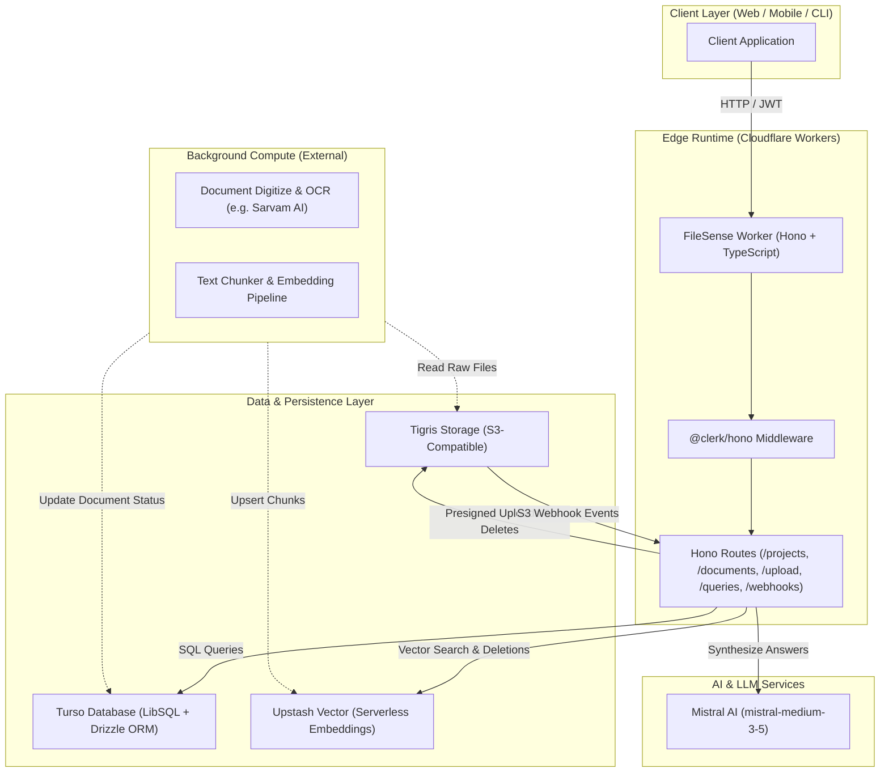
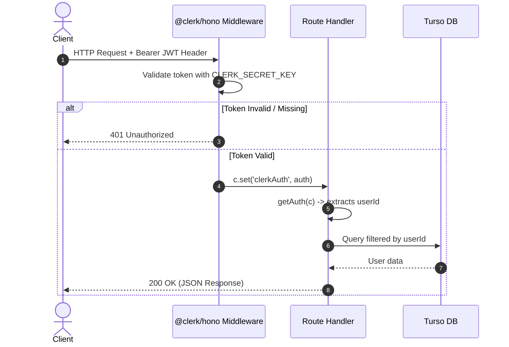
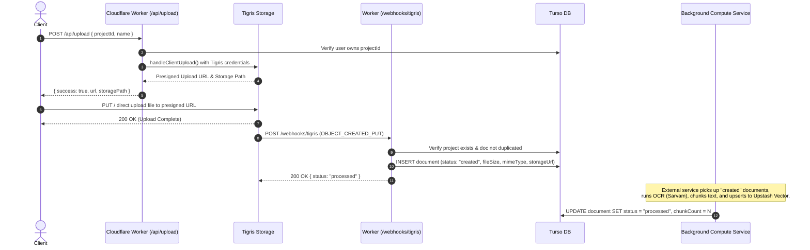
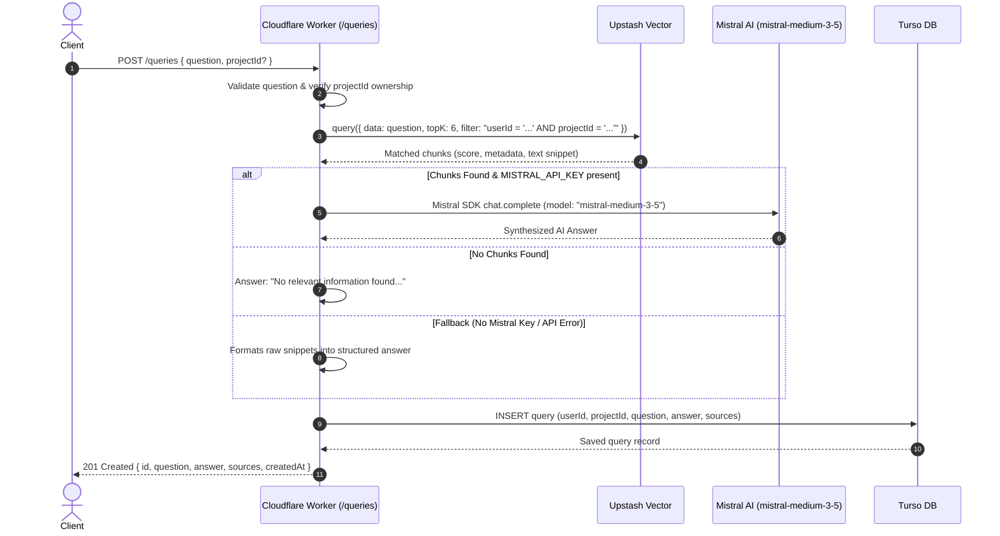
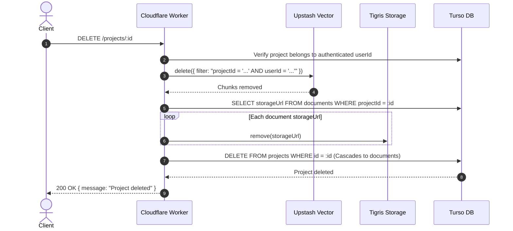

# FileSense Architecture & System Flow

This document provides a comprehensive technical overview of the **FileSense Worker** codebase, detailing the system architecture, component responsibilities, data models, and end-to-end request/event flows.

---

## 1. System Overview

FileSense is an AI-powered document intelligence and semantic search backend. It allows users to organize files into projects, upload documents to decentralized S3-compatible cloud storage (Tigris), automatically ingest document metadata, and perform Retrieval-Augmented Generation (RAG) queries across their documents using vector embeddings and large language models.



---

## 2. Technology Stack

| Layer / Concern | Technology | Role / Purpose |
|---|---|---|
| **Runtime** | Cloudflare Workers (`workerd`) | Low-latency global edge execution with zero cold starts |
| **HTTP Framework** | [Hono](https://hono.dev/) (`v4`) | Lightweight, ultra-fast routing framework optimized for edge environments |
| **Authentication** | [@clerk/hono](https://clerk.com/) | JWT validation, user session verification, and identity extraction |
| **Database** | [Turso](https://turso.tech/) (LibSQL) | Distributed SQLite at the edge |
| **ORM** | [Drizzle ORM](https://orm.drizzle.team/) (`v1-rc`) | Type-safe SQL builder with zero runtime overhead |
| **Object Storage** | [Tigris Data](https://www.tigrisdata.com/) (`@tigrisdata/storage`) | Globally distributed S3-compatible object storage with event webhooks |
| **Vector Database** | [Upstash Vector](https://upstash.com/docs/vector/overall) | Serverless vector database with built-in embeddings and metadata filtering |
| **Validation** | [Zod](https://zod.dev/) | Request body, query string, and route parameter validation |
| **LLM Inference** | Mistral AI (`mistral-medium-3-5`) | Single, fixed frontier LLM for grounded answer synthesis |

---

## 3. Directory Structure

```
file-sense-worker/
├── src/
│   ├── index.ts                 # Main Worker entrypoint: middleware, routing, error handling
│   ├── db/
│   │   ├── index.ts             # Cached Turso LibSQL client & Drizzle instance provider
│   │   └── schema.ts            # Drizzle ORM schema: tables, indexes, and relations
│   ├── routes/
│   │   ├── projects.ts          # CRUD for user projects and document aggregation
│   │   ├── documents.ts         # Document retrieval, project document listings, and deletion
│   │   ├── upload.ts            # Tigris presigned upload URL generation
│   │   ├── queries.ts           # RAG search, LLM answer synthesis, and query history
│   │   └── webhooks/
│   │       └── tigris.ts        # Ingestion webhook for Tigris S3 object events
│   ├── services/
│   │   ├── storage.ts           # Tigris storage configuration and removal utilities
│   │   └── vector.ts            # Upstash Vector client initialization and caching
│   └── validators/
│       ├── project.ts           # Zod validation schemas for project endpoints
│       ├── document.ts          # Zod validation schemas for document endpoints
│       ├── query.ts             # Zod validation schemas for queries
│       └── upload.ts            # Zod validation schemas for upload requests
├── drizzle/                     # Drizzle migration files and metadata
├── drizzle.config.ts            # Drizzle Kit CLI configuration (Turso dialect)
├── worker-configuration.d.ts    # Generated TypeScript definitions for Worker bindings
├── wrangler.jsonc               # Cloudflare Wrangler configuration and compatibility flags
└── package.json                 # Project dependencies and deployment scripts
```

---

## 4. Data Models & Schemas

### 4.1 Database Tables (Turso via Drizzle ORM)

Located in [`src/db/schema.ts`](file:///Users/basavarajmuttagi/Desktop/Agentic%20Ai%20Projects/file-sense-worker/src/db/schema.ts):

#### `projects`
Represents a collection of documents belonging to a user.
- `id` (`text`, Primary Key, UUID)
- `userId` (`text`, indexed) — Clerk User ID
- `title` (`text`, not null) — Project title (max 200 chars)
- `description` (`text`, nullable) — Project description (max 1000 chars)
- `createdAt` (`timestamp`, indexed)
- `updatedAt` (`timestamp`)

#### `documents`
Metadata for individual files uploaded to Tigris storage.
- `id` (`text`, Primary Key, UUID)
- `projectId` (`text`, indexed, Foreign Key -> `projects.id`, cascade delete)
- `title` (`text`, not null) — Human-readable document name
- `fileName` (`text`, not null) — Original filename
- `mimeType` (`text`, not null) — e.g. `application/pdf`
- `fileSize` (`integer`, not null) — File size in bytes
- `storageUrl` (`text`, nullable) — S3 key / Tigris storage path
- `chunkCount` (`integer`, default 0) — Number of indexed chunks
- `status` (`text`: `"created" | "processed" | "error"`, indexed)
- `createdAt` (`timestamp`, indexed)
- `updatedAt` (`timestamp`)

#### `queries`
Persisted audit trail of user queries, synthesized answers, and cited sources.
- `id` (`text`, Primary Key, UUID)
- `userId` (`text`, indexed)
- `projectId` (`text`, nullable, indexed, Foreign Key -> `projects.id`, set null)
- `question` (`text`, not null)
- `answer` (`text`, nullable)
- `sources` (`json`, nullable) — Array of cited snippets:
  ```json
  [
    {
      "title": "document.pdf",
      "fileName": "document.pdf",
      "chunkIndex": 0,
      "text": "Extracted snippet text...",
      "score": 0.89
    }
  ]
  ```
- `createdAt` (`timestamp`, indexed)
- `updatedAt` (`timestamp`)

### 4.2 Upstash Vector Representation

Chunks are indexed in Upstash Vector with the following structure:
- **`id`**: `${documentId}:${chunkIndex}`
- **`data`**: Raw textual content of the chunk (used for automatic embedding & context extraction)
- **`metadata`**:
  ```json
  {
    "userId": "user_123",
    "projectId": "proj_456",
    "docId": "doc_789",
    "docName": "quarterly-report.pdf",
    "pageStart": 1,
    "pageEnd": 3,
    "chunkIndex": 0
  }
  ```

---

## 5. End-to-End System Flows

### 5.1 Request Authentication Flow

Every user-facing route is secured by `@clerk/hono`.



---

### 5.2 Document Upload & Webhook Ingestion Flow

To keep the Cloudflare Worker lightweight and bypass edge memory/bandwidth limitations, files are uploaded directly from the client to Tigris Storage using presigned upload URLs.



---

### 5.3 RAG Question & Answer Flow

When a user submits a question, the Worker searches the vector database, formats the retrieved context, synthesizes an answer using **Mistral AI (`mistral-medium-3-5`)**, and records the interaction in Turso.



---

### 5.4 Cascade Deletion Flow

Deleting a project or document triggers cascade cleanup across the relational database, object storage, and vector index.



---

## 6. Environment Configuration

All environment variables and secrets are accessed in Hono handlers via `c.env`:

| Variable | Description |
|---|---|
| `DATABASE_URL` | Turso LibSQL database URL (e.g., `libsql://<db>-<org>.turso.io`) |
| `TOKEN` | Turso authentication token |
| `CLERK_PUBLISHABLE_KEY` | Clerk publishable key |
| `CLERK_SECRET_KEY` | Clerk secret key for token verification |
| `TIGRIS_STORAGE_ACCESS_KEY_ID` | Tigris S3 access key ID |
| `TIGRIS_STORAGE_SECRET_ACCESS_KEY` | Tigris S3 secret access key |
| `TIGRIS_STORAGE_ENDPOINT` | Tigris S3 endpoint (`https://t3.storage.dev`) |
| `TIGRIS_BUCKET_NAME` | S3 bucket name (defaults to `filesense`) |
| `UPSTASH_VECTOR_REST_URL` | Upstash Vector REST endpoint URL |
| `UPSTASH_VECTOR_REST_TOKEN` | Upstash Vector REST authentication token |
| `MISTRAL_API_KEY` | Mistral AI API key for chat completion RAG synthesis (`mistral-medium-3-5`) |
| `SARVAM_API_KEY` | (Optional) Sarvam AI key for document OCR/digitization |

---

## 7. Developer Cheatsheet

### Running Locally
```bash
npm run dev
# Starts local workerd instance at http://localhost:8787
```

### Type Checking & Validation
```bash
# Type check all routes and database queries
npx tsc --noEmit

# Test Wrangler production build without deploying
npx wrangler deploy --dry-run
```

### Database Schema Migrations
```bash
# Generate Drizzle migration files
npx drizzle-kit generate

# Apply migrations to Turso
npx drizzle-kit migrate
```

### Refreshing Worker Binding Types
```bash
# Regenerate worker-configuration.d.ts after modifying wrangler.jsonc or .env
npm run types
```
