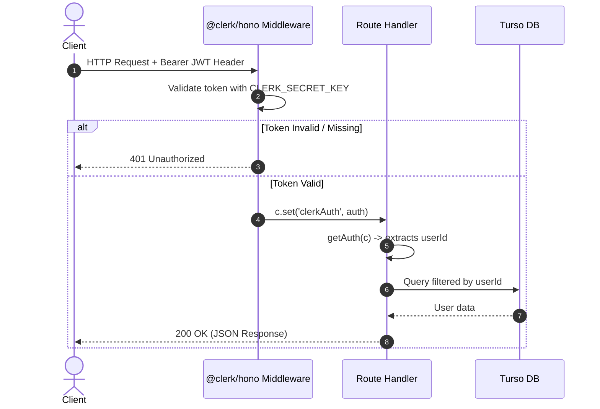
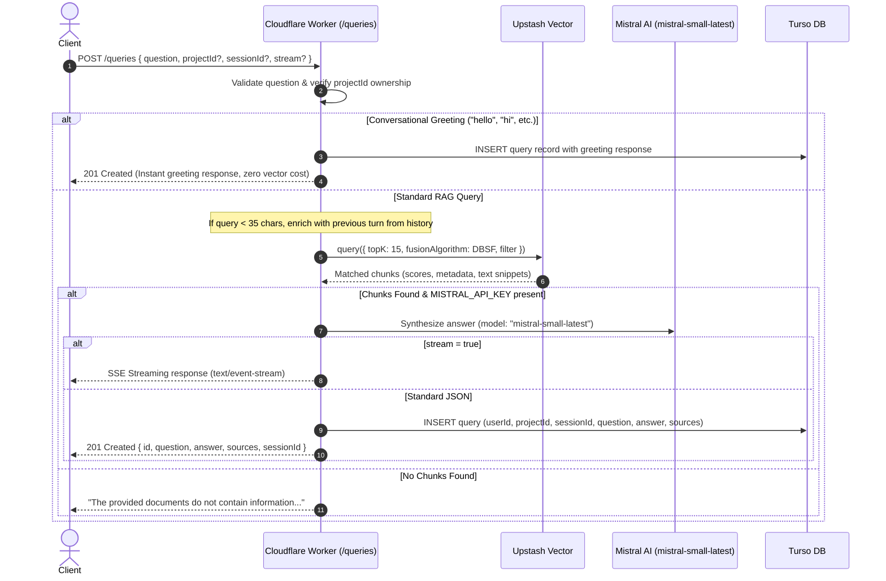
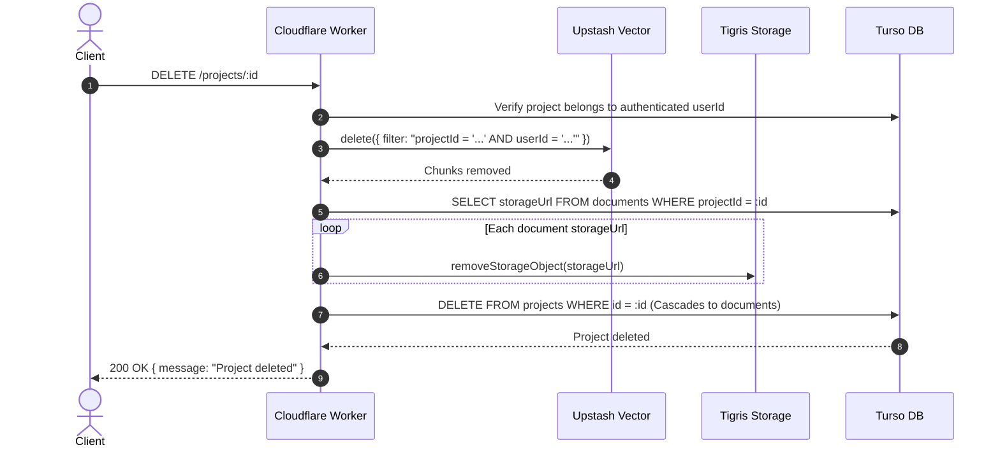

# FileSense Architecture & System Flow

This document provides a comprehensive technical overview of the **FileSense Worker** codebase, detailing the system architecture, component responsibilities, data models, and end-to-end request/event flows.

---

## 1. System Overview

FileSense is an AI-powered document intelligence and semantic search backend. It allows users to organize files into projects, upload documents to decentralized S3-compatible cloud storage (Tigris), automatically ingest document metadata, and perform Retrieval-Augmented Generation (RAG) queries across their documents using hybrid vector search (Dense + BM25) and large language models.

```mermaid
flowchart TB
    subgraph ClientLayer["Client Layer (Web / Mobile / CLI)"]
        Client["Client Application"]
    end

    subgraph EdgeLayer["Edge Runtime (Cloudflare Workers)"]
        Worker["FileSense Worker (Hono + TypeScript)"]
        ClerkMW["@clerk/hono Middleware"]
        Router["Hono Routes (/projects, /documents, /upload, /queries, /webhooks)"]
    end

    subgraph StorageLayer["Data & Persistence Layer"]
        Turso["Turso Database (LibSQL + Drizzle ORM)"]
        Tigris["Tigris Storage (S3-Compatible)"]
        Upstash["Upstash Vector (Hybrid Dense + BM25 Embeddings)"]
    end

    subgraph AILayer["AI & LLM Services"]
        Mistral["Mistral AI (mistral-small-latest)"]
    end

    subgraph ComputeLayer["Serverless Compute Sandbox (Upstash Ephemeral Box)"]
        Box["Upstash Ephemeral Box (On-Demand Linux Container)"]
        DocAI["Sarvam Doc AI (OCR)"]
        Chunker["Text Chunker & Embedding Pipeline"]
    end

    Client -->|HTTP / JWT| Worker
    Worker --> ClerkMW --> Router
    Router -->|SQL Queries| Turso
    Router -->|Presigned Uploads & Deletes| Tigris
    Router -->|Hybrid Vector Search (DBSF) & Deletions| Upstash
    Router -->|Synthesize Answers / SSE Streaming| Mistral
    Tigris -->|S3 Webhook Events| Router
    Router -.->|waitUntil: Dispatch Job| Box
    Box -.->|Download via Presigned GET| Tigris
    Box -.->|Run OCR| DocAI
    Box -.->|Batch Upsert Chunks| Upstash
    Box -.->|UPDATE status = processed| Turso
    Box -.->|Explicit box.delete() Cleanup| Box
```

---

## 2. Technology Stack

| Layer / Concern | Technology | Role / Purpose |
|---|---|---|
| **Runtime** | Cloudflare Workers (`workerd`) | Low-latency global edge execution with zero cold starts |
| **HTTP Framework** | [Hono](https://hono.dev/) (`v4`) | Lightweight, ultra-fast routing framework optimized for edge environments |
| **Authentication** | [@clerk/hono](https://clerk.com/) | JWT validation, user session verification, and identity extraction |
| **Database** | [Turso](https://turso.tech/) (LibSQL) | Distributed SQLite at the edge |
| **ORM** | [Drizzle ORM](https://orm.drizzle.team/) (`v1-rc`) | Type-safe SQL builder with zero runtime overhead |
| **Object Storage** | [Tigris Data](https://www.tigrisdata.com/) (`@tigrisdata/storage`) | Globally distributed S3-compatible object storage with event webhooks |
| **Compute Sandbox** | [Upstash Box](https://upstash.com/docs/box) (`@upstash/box`) | Serverless on-demand Ephemeral Box (small, 10 min TTL) with auto-destruction and explicit cleanup |
| **Vector Database** | [Upstash Vector](https://upstash.com/docs/vector/overall) | Serverless vector database with built-in hybrid search (Dense + BM25) and metadata filtering |
| **Validation** | [Zod](https://zod.dev/) | Request body, query string, and route parameter validation |
| **LLM Inference** | Mistral AI (`@mistralai/mistralai`) | Direct synthesis via `mistral-small-latest` with strict grounding & inline citations |
| **Testing** | [Vitest](https://vitest.dev/) (`v5`) | Hermetic, fast in-memory test suite adhering to Hono testing conventions (`app.request`) |

---

## 3. Directory Structure

```
file-sense-worker/
├── src/
│   ├── index.ts                 # Main Worker entrypoint: middleware, routing, error handling
│   ├── db/
│   │   ├── index.ts             # Cached Turso LibSQL client & Drizzle instance provider
│   │   └── schema.ts            # Drizzle ORM schema: tables, indexes, and relations
│   ├── routes/
│   │   ├── projects.ts          # CRUD for user projects and document aggregation
│   │   ├── documents.ts         # Document retrieval, project document listings, and deletion
│   │   ├── upload.ts            # Tigris presigned upload URL generation
│   │   ├── queries.ts           # RAG search, LLM answer synthesis, sessions, and SSE streaming
│   │   └── webhooks/
│   │       └── tigris.ts        # Ingestion webhook for Tigris S3 object events
│   ├── services/
│   │   ├── box.ts               # Upstash Ephemeral Box provisioning, credential injection, and cleanup
│   │   ├── pipeline-runner.ts   # Self-contained Node.js OCR & chunking runner template
│   │   ├── storage.ts           # Tigris storage configuration, presigned URLs, and removal utilities
│   │   └── vector.ts            # Upstash Vector client initialization and caching
│   └── validators/
│       ├── project.ts           # Zod validation schemas for project endpoints
│       ├── document.ts          # Zod validation schemas for document endpoints
│       ├── query.ts             # Zod validation schemas for query input, sessions, and history
│       └── upload.ts            # Zod validation schemas for upload requests
├── tests/
│   ├── fixtures/
│   │   └── mock-env.ts          # Typed MOCK_ENV Cloudflare Worker bindings
│   ├── helpers/
│   │   ├── auth.ts              # Authentication state mock helpers (setMockUser, resetMockUser)
│   │   └── db.ts                # Drizzle ORM chainable query builder mock (createMockDb, createChainable)
│   ├── routes/
│   │   ├── health.test.ts       # Health, root, 404, and HTTPException handling tests
│   │   ├── projects.test.ts     # Project CRUD, auth isolation, and cascade cleanup tests
│   │   ├── documents.test.ts    # Document retrieval, authorization checks, and deletion tests
│   │   ├── upload.test.ts       # Upload path construction and Tigris client upload tests
│   │   ├── webhooks.test.ts     # Tigris S3 webhook event handling and dispatch tests
│   │   └── queries.test.ts      # Query validation, greetings, session aggregation, and history tests
│   ├── services/
│   │   ├── box.test.ts          # Ephemeral Box container lifecycle and failure handling tests
│   │   ├── storage.test.ts      # Tigris presigned download and delete tests
│   │   └── vector.test.ts       # Upstash Vector client singleton caching tests
│   ├── validators/
│   │   ├── project.test.ts      # Project Zod schema unit tests
│   │   ├── document.test.ts     # Document Zod schema unit tests
│   │   ├── query.test.ts        # Query Zod schema unit tests
│   │   └── upload.test.ts       # Upload Zod schema unit tests
│   └── setup.ts                 # Global Vitest lifecycle: process.env binding & Clerk mock
├── drizzle/                     # Drizzle migration files and metadata
├── drizzle.config.ts            # Drizzle Kit CLI configuration (Turso dialect)
├── worker-configuration.d.ts    # Generated TypeScript definitions for Worker bindings
├── wrangler.jsonc               # Cloudflare Wrangler configuration and compatibility flags
├── vitest.config.mts            # Vitest test runner configuration
└── package.json                 # Project dependencies, test scripts, and deployment scripts
```

---

## 4. Data Models & Schemas

### 4.1 Database Tables (Turso via Drizzle ORM)

Located in [`src/db/schema.ts`](file:///Users/basavarajmuttagi/Desktop/Agentic%20Ai%20Projects/file-sense-worker/src/db/schema.ts):

#### `projects`
Represents a collection of documents belonging to a user.
- `id` (`text`, Primary Key, UUID)
- `userId` (`text`, indexed) — Clerk User ID
- `title` (`text`, not null) — Project title (max 200 chars)
- `description` (`text`, nullable) — Project description (max 1000 chars)
- `createdAt` (`timestamp`, indexed)
- `updatedAt` (`timestamp`)

#### `documents`
Metadata for individual files uploaded to Tigris storage.
- `id` (`text`, Primary Key, UUID)
- `projectId` (`text`, indexed, Foreign Key -> `projects.id`, cascade delete)
- `title` (`text`, not null) — Human-readable document name
- `fileName` (`text`, not null) — Original filename
- `mimeType` (`text`, not null) — e.g. `application/pdf`
- `fileSize` (`integer`, not null) — File size in bytes
- `storageUrl` (`text`, nullable) — S3 key / Tigris storage path
- `chunkCount` (`integer`, default 0) — Number of indexed chunks
- `status` (`text`: `"created" | "processing" | "processed" | "error"`, indexed)
- `createdAt` (`timestamp`, indexed)
- `updatedAt` (`timestamp`)

#### `queries`
Persisted audit trail of user queries, synthesized answers, and cited sources.
- `id` (`text`, Primary Key, UUID)
- `userId` (`text`, indexed)
- `projectId` (`text`, nullable, indexed, Foreign Key -> `projects.id`, set null)
- `sessionId` (`text`, nullable, indexed) — Thread / conversation session ID
- `question` (`text`, not null)
- `answer` (`text`, nullable)
- `sources` (`json`, nullable) — Array of cited snippets:
  ```json
  [
    {
      "title": "document.pdf",
      "fileName": "document.pdf",
      "chunkIndex": 0,
      "text": "Extracted snippet text...",
      "score": 0.89,
      "pageStart": 1,
      "pageEnd": 1
    }
  ]
  ```
- `createdAt` (`timestamp`, indexed)
- `updatedAt` (`timestamp`)

### 4.2 Upstash Vector Representation

Chunks are indexed in Upstash Vector using hybrid indexing (Dense + BM25):
- **`id`**: `${documentId}#page${chunk.page}#chunk${chunk.chunkIndex}`
- **`data`**: Raw textual content of the chunk (used for automatic embedding & context extraction)
- **`metadata`**:
  ```json
  {
    "userId": "user_123",
    "projectId": "proj_456",
    "docId": "doc_789",
    "docName": "quarterly-report.pdf",
    "page": 1,
    "pageStart": 1,
    "pageEnd": 1,
    "chunkIndex": 0,
    "type": "content",
    "text": "Extracted snippet text...",
    "isFirstChunkOfPage": true,
    "isLastChunkOfPage": false,
    "isOverlapped": false,
    "uploadedAt": "2026-09-30T10:00:00.000Z"
  }
  ```

---

## 5. End-to-End System Flows

### 5.1 Request Authentication Flow

Every user-facing route is secured by `@clerk/hono`.


```mermaid
sequenceDiagram
    autonumber
    actor Client
    participant MW as @clerk/hono Middleware
    participant Route as Route Handler
    participant Turso as Turso DB

    Client->>MW: HTTP Request + Bearer JWT Header
    MW->>MW: Validate token with CLERK_SECRET_KEY
    alt Token Invalid / Missing
        MW-->>Client: 401 Unauthorized
    else Token Valid
        MW->>Route: c.set('clerkAuth', auth)
        Route->>Route: getAuth(c) -> extracts userId
        Route->>Turso: Query filtered by userId
        Turso-->>Route: User data
        Route-->>Client: 200 OK (JSON Response)
    end
```

---

### 5.2 Document Upload & Webhook Ingestion Flow

To keep the Cloudflare Worker lightweight and bypass edge memory/bandwidth limitations, files are uploaded directly from the client to Tigris Storage using presigned upload URLs.

```mermaid
sequenceDiagram
    autonumber
    actor Client
    participant Worker as Cloudflare Worker (/api/upload)
    participant Tigris as Tigris Storage
    participant Webhook as Worker (/webhooks/tigris)
    participant Turso as Turso DB
    participant Box as Upstash Ephemeral Box

    %% Step 1: Request Presigned URL
    Client->>Worker: POST /api/upload { projectId, name }
    Worker->>Turso: Verify user owns projectId
    Worker->>Tigris: handleClientUpload() with Tigris credentials
    Tigris-->>Worker: Presigned Upload URL & Storage Path
    Worker-->>Client: { success: true, url, storagePath }

    %% Step 2: Client uploads directly to Tigris
    Client->>Tigris: PUT / direct upload file to presigned URL
    Tigris-->>Client: 200 OK (Upload Complete)

    %% Step 3: Tigris triggers S3 Webhook
    Tigris->>Webhook: POST /webhooks/tigris (OBJECT_CREATED)
    Webhook->>Turso: Verify project exists & doc not duplicated
    Webhook->>Turso: INSERT document (status: "processing", fileSize, mimeType, storageUrl)
    Webhook->>Webhook: executionCtx.waitUntil(dispatchDocumentProcessing)
    Webhook-->>Tigris: 200 OK { status: "ok" }

    %% Step 4: Upstash Ephemeral Box Execution
    Note over Box: Provisions isolated Ephemeral Box (small, 10 min TTL)
    Webhook->>Box: EphemeralBox.create({ env: secrets & parameters })
    Box->>Tigris: Download file via presigned GET URL
    Box->>Sarvam: POST /digitise -> poll status -> extract pages (JSON format)
    Box->>Box: Chunk text with page and index metadata (25% overlap)
    Box->>Upstash: Batch upsert chunks with metadata (native SDK retries)
    Box->>Turso: UPDATE documents SET status = "processed", chunkCount = N
    Note over Box: box.delete() deletes container immediately upon completion
```

---

### 5.3 RAG Question & Answer Flow

When a user submits a question, the Worker evaluates conversational greetings, enriches follow-ups if needed, queries the vector database using hybrid fusion, and synthesizes answers using **Mistral AI (`mistral-small-latest`)** with strict source grounding and inline citations.


```mermaid
sequenceDiagram
    autonumber
    actor Client
    participant Worker as Cloudflare Worker (/queries)
    participant Upstash as Upstash Vector
    participant Mistral as Mistral AI (mistral-small-latest)
    participant Turso as Turso DB

    Client->>Worker: POST /queries { question, projectId?, sessionId?, stream? }
    Worker->>Worker: Validate question & verify projectId ownership

    alt Conversational Greeting ("hello", "hi", etc.)
        Worker->>Turso: INSERT query record with greeting response
        Worker-->>Client: 201 Created (Instant greeting response, zero vector cost)
    else Standard RAG Query
        %% Short-query enrichment
        Note over Worker: If query < 35 chars, enrich with previous turn from history

        %% Hybrid Vector Search
        Worker->>Upstash: query({ topK: 15, fusionAlgorithm: DBSF, filter })
        Upstash-->>Worker: Matched chunks (scores, metadata, text snippets)

        %% Direct LLM Synthesis
        alt Chunks Found & MISTRAL_API_KEY present
            Worker->>Mistral: Synthesize answer (model: "mistral-small-latest")
            alt stream = true
                Worker-->>Client: SSE Streaming response (text/event-stream)
            else Standard JSON
                Worker->>Turso: INSERT query (userId, projectId, sessionId, question, answer, sources)
                Worker-->>Client: 201 Created { id, question, answer, sources, sessionId }
            end
        else No Chunks Found
            Worker-->>Client: "The provided documents do not contain information..."
        end
    end
```

---

### 5.4 Cascade Deletion Flow

Deleting a project or document triggers cascade cleanup across the relational database, object storage, and vector index.


```mermaid
sequenceDiagram
    autonumber
    actor Client
    participant Worker as Cloudflare Worker
    participant Upstash as Upstash Vector
    participant Tigris as Tigris Storage
    participant Turso as Turso DB

    Client->>Worker: DELETE /projects/:id
    Worker->>Turso: Verify project belongs to authenticated userId

    %% Upstash cleanup
    Worker->>Upstash: delete({ filter: "projectId = '...' AND userId = '...'" })
    Upstash-->>Worker: Chunks removed

    %% Tigris cleanup
    Worker->>Turso: SELECT storageUrl FROM documents WHERE projectId = :id
    loop Each document storageUrl
        Worker->>Tigris: removeStorageObject(storageUrl)
    end

    %% Turso cleanup
    Worker->>Turso: DELETE FROM projects WHERE id = :id (Cascades to documents)
    Turso-->>Worker: Project deleted
    Worker-->>Client: 200 OK { message: "Project deleted" }
```

---

## 6. Environment Configuration

All environment variables and secrets are accessed in Hono handlers via `c.env`:

| Variable | Description |
|---|---|
| `DATABASE_URL` | Turso LibSQL database URL (e.g., `libsql://<db>-<org>.turso.io`) |
| `TOKEN` | Turso authentication token |
| `CLERK_PUBLISHABLE_KEY` | Clerk publishable key |
| `CLERK_SECRET_KEY` | Clerk secret key for token verification |
| `TIGRIS_STORAGE_ACCESS_KEY_ID` | Tigris S3 access key ID |
| `TIGRIS_STORAGE_SECRET_ACCESS_KEY` | Tigris S3 secret access key |
| `TIGRIS_STORAGE_ENDPOINT` | Tigris S3 endpoint (`https://t3.storage.dev`) |
| `TIGRIS_STORAGE_BUCKET` | S3 bucket name (preferred over `TIGRIS_BUCKET_NAME`, defaults to `filesense-bucket`) |
| `TIGRIS_BUCKET_NAME` | Fallback S3 bucket name |
| `UPSTASH_VECTOR_REST_URL` | Upstash Vector REST endpoint URL |
| `UPSTASH_VECTOR_REST_TOKEN` | Upstash Vector REST authentication token |
| `MISTRAL_API_KEY` | Mistral AI API key for RAG answer synthesis (`mistral-small-latest`) |
| `SARVAM_API_KEY` | Sarvam AI key for document OCR/digitization |
| `UPSTASH_BOX_API_KEY` | (Optional) Upstash Box API key for on-demand Ephemeral Box OCR & chunking |

---

## 7. Developer Cheatsheet

### Running Locally
```bash
npm run dev
# Starts local workerd instance at http://localhost:8787
```

### Automated Testing (Vitest)
```bash
# Run all unit and integration tests
npm test

# Run tests in watch mode
npm run test:watch
```

### Type Checking & Validation
```bash
# Type check all routes, tests, and database queries
npx tsc --noEmit

# Test Wrangler production build without deploying
npx wrangler deploy --dry-run
```

### Database Schema Migrations
```bash
# Generate Drizzle migration files
npx drizzle-kit generate

# Apply migrations to Turso
npx drizzle-kit migrate
```

### Refreshing Worker Binding Types
```bash
# Regenerate worker-configuration.d.ts after modifying wrangler.jsonc or .env
npm run types
```
